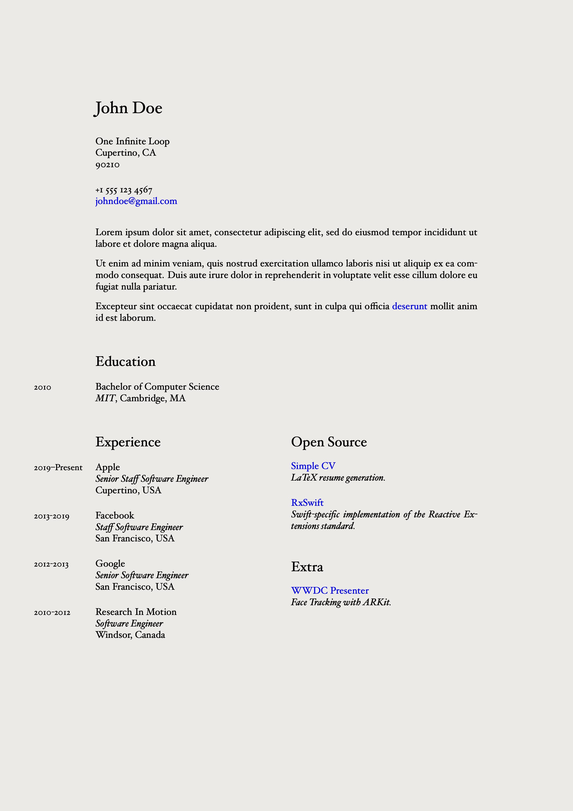

# Simple CV

A simple (automated) template for LaTex formatted resumes.

This repository is a [fork](https://github.com/mrzool/cv-boilerplate) from [mrzool](https://github.com/mrzool)'s original projec with the following changes:

- A streamlined/simplified template (for s/w engineers).
- Install instructions (for first time LaTeX users).
- Additional customization options. 

## Insallation

1. Clone repository:

    ```
    $ git clone git@github.com:terryworona/simple-cv.git
    ```

2. Download and install [TinyTeX](https://yihui.org/tinytex/):

    ```
    curl -sL "https://yihui.org/tinytex/install-bin-unix.sh" | sh
    ```

3. Install [Pandoc](http://pandoc.org/), the universal document converter (direct download [here](https://pandoc.org/installing.html)). 

4. Install the following packages (via [tlmgr](https://www.tug.org/texlive/tlmgr.html) - included with [TinyTeX](https://yihui.org/tinytex/)):

    ```
    $ tlmgr install fontspec
    $ tlmgr install geometry
    $ tlmgr install hyperref
    $ tlmgr install marginnote
    $ tlmgr install multicol
    $ tlmgr install pagecolor
    $ tlmgr install polyglossia
    $ tlmgr install sectsty
    $ tlmgr install titlesec
    $ tlmgr install ulem
    $ tlmgr install xltxtra
    $ tlmgr install xunicode
    ```

## Configuration

As stated in the original [repository](https://github.com/mrzool/cv-boilerplate) - The separation of content from presentation is considered a universal best practice:

- **Content**: `details.yml` - includes all the specifics about your resume (i.e. work history, education, etc). 
- **Presentation**: `template.tex` - defines the overall structure of your resume. 
- **Binder**: `makefile` - ties the presentation logic to the underlyign content to produce `output.pdf`. 

This structure makes it incredibly easy to update your CV while keeping the structure consistent. 

## Getting Started

My own personal resume can be found via the branch `release` where I've tagged different versions of my ever-evolving work history. 

The `master` branch of this repository contains "dummy data" that you can use as a starter project. Simply replace the placeholder information with your own. 

## Generation

1. Fill `details.yml` with your contact info, work experience, education, and desired settings.
2. Run `make` to compile the PDF.
3. Tweak on `template.tex` until you're satisfied with the result.

LaTeX takes then care of the typesetting with its usual elegance. Below a preview of the final result. Check out [output](output.pdf) to see the compiled PDF.



## Settings

- `background-*` - RGB values for the background color (for white, use `1.0`, `1.0`, `1.0`).
- `mainfont` - Hoefler Text is the default, but any font installed on your system should work.
- `fontsize` - possible values here are 10pt, 11pt and 12pt.
- `lang` - sets the language via `polyglossia` (important for proper hyphenation).
- `geometry` - a string that sets the margins via `geometry`. 
- `spacing-content` - vertical space between content within a section (i.e. About). 
- `spacing-subsection` - vertical space between subcomponents within a section (i.e. Expierence). 

## License

This repository contains a modified version of Mattia Tezzele's [cv-boilerplate](https://github.com/mrzool/cv-boilerplate) template which is an extension of Dario Taraborelli's [cvtex](https://github.com/dartar/cvtex) project.

License: [CC BY-SA 3.0](http://creativecommons.org/licenses/by-sa/3.0/)
